# PARCIAL AREP T2
EL Objetivo principal es diseñar una calculadora de 2 operaciones usando spark, debe tener 2 funcionaes desplegadas en al menos dos instancias virtuales de EC2. Además debe implementar un service proxy que recibe las solicitudes de 
servicios y se las delega a las dos instancias usando un algoritmo de round-robin

### Aplicativo:

El aplicativo cuenta con una clase controller spark la cual tiene 2 endpoints uno para funciones de sin y otras para funciones ln. internamente en los endpoints van a la implementacion de los servicios para obtener el valor de cada operacion, para dar la respuesta se almacena en un DTO los valores de entrada salida y operacion y finalmente estos se imprimen como un tipo json

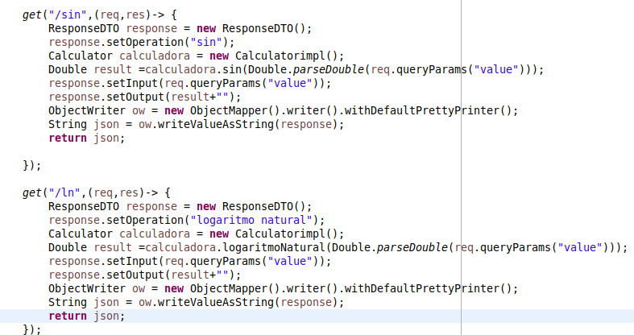 

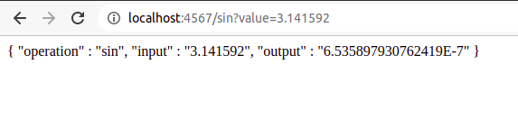

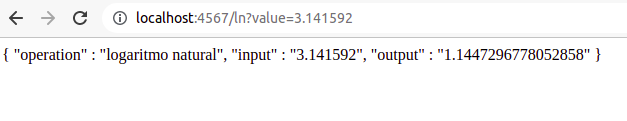

### Como Ejecutarlo?

Si se desea ejecutar de manera local se debe clonar y compilar el archivo correctamente, luego consumir el servicio usando alguno de los siguientes endpoints

* http://localhost:4567/sin?value=3.141592
* http://localhost:4567/ln?value=3.141592

### DOCKER
##Creacion imagen 

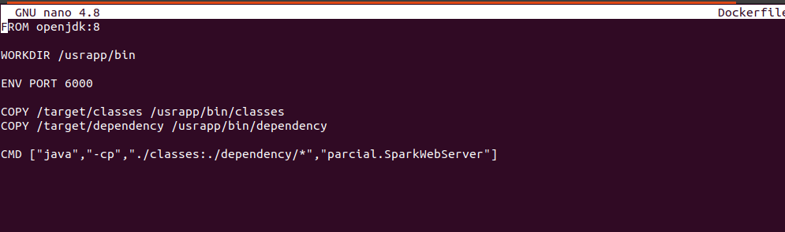
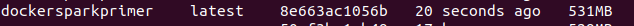

Creacion dos instancias contenedor docker

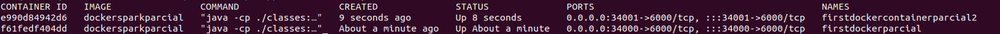

Creacion configuracion docker

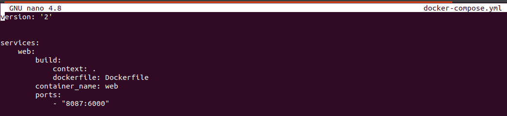

Verificacion creacion servicio web

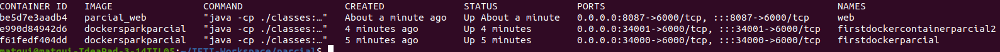


##Subir Imagen docker

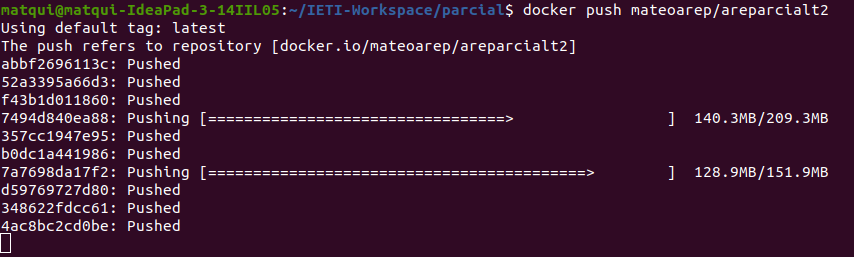
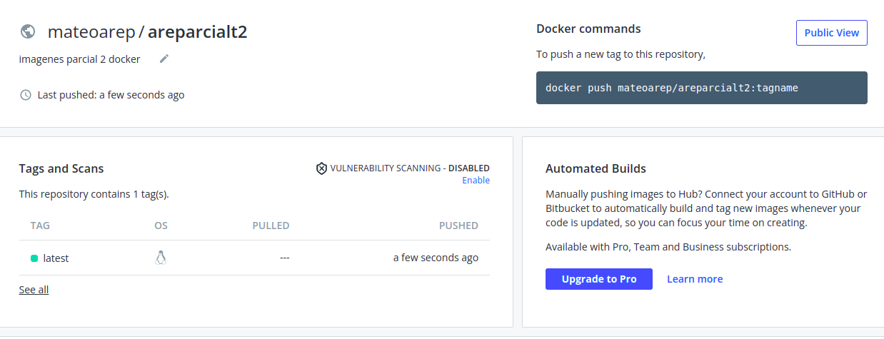


### AWS

Para poder correrlo en AWS EC2 es necesario crear una maquina virtual linux, una vez ahi se debe entrar a la consola de la maquina y instalar docker, esto con la finalidad de que pueda cargar la imagen subida anteriormente al repositorio docker


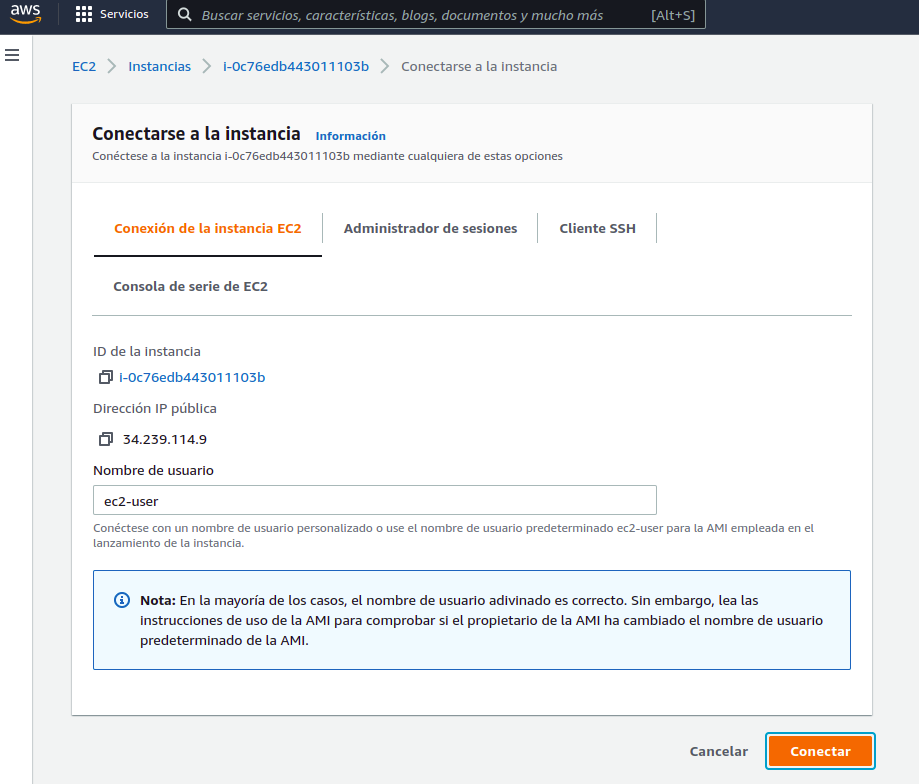


luego de instalar docker y cargar la imagen se debe poner a correr con el comando docker run -d -p 42000:6000 --name firstdockerimageaws mateoarep/areparcialt2

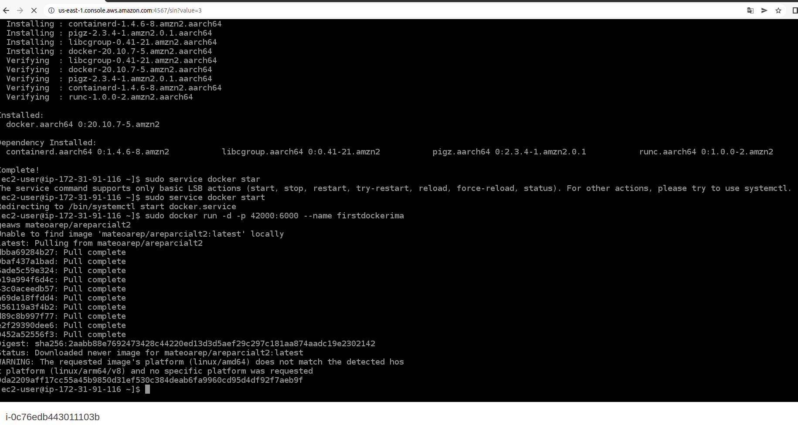

Una vez este corriendo docker Pasamos a las configuraciones de seguirdad para que la maquina virtual abra los puertos por los que va a responder el servicio

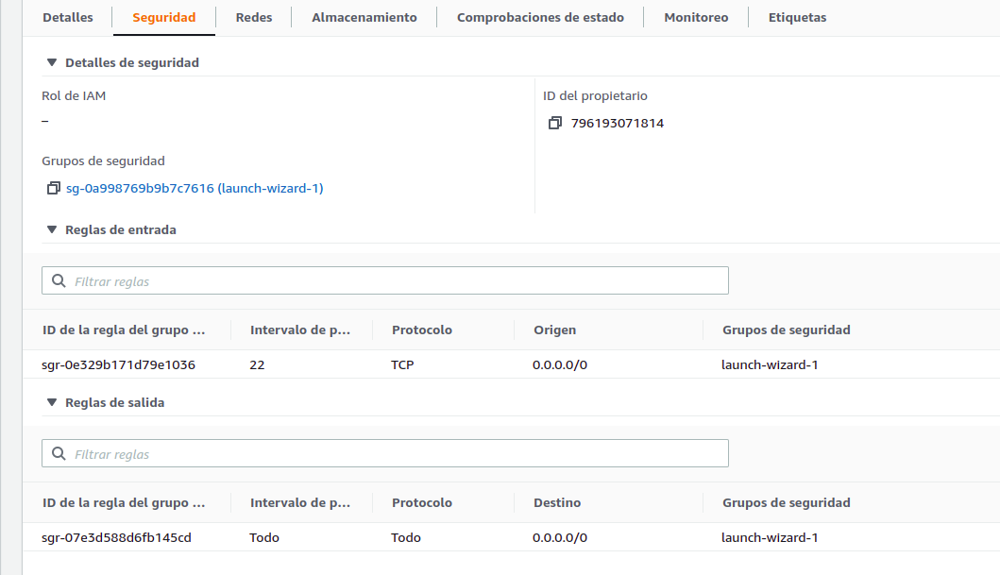


Cuando se abran los puertos se puede acceder al servicio de la siguiente manera:

ejemplo:

https://amazonxxx.x.xxx.x.xxx:{port}/sin?value=3.141592


### VIDEO


### Prerrequisitos

Los pasos a continuación permiten clonar el programa en su computador.


Eston son los requisitos que software que tienen que estar instalados previamente:

```
Maven
```
```
Git
```
```
Fue ejecutado con version java 1.8
```


## Construcción 
* [Maven](https://maven.apache.org/) - Dependencias de maven

## Fecha
* 30 Marzo 2022

## Autores

* **Mateo Quintero Acevedo** 

## Javadoc

* El javadoc fue obtenido mediante la herramienta eclipse quien cuenta con la opcion de autogenerado
	
## Licencia

En este proyecto se usó la licencia GNU - se puede ver [LICENSE](LICENSE) para más detalles.

